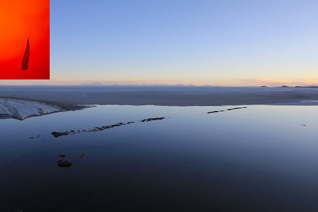

# RestAPI-Image

Este projeto é uma API REST para manipulação de imagens, desenvolvida em ASP.NET Core com C#. Permite que os usuários enviem uma imagem codificada em base64, apliquem uma marca d'água configurável e obtenham a imagem resultante.

## Índice
1. [Recursos](#recursos)
2. [Instalação](#instalação)
3. [Uso](#uso)
4. [Exemplos](#exemplos)
5. [Contribuição](#contribuição)
6. [Licença](#licença)

## Recursos

- Receber uma imagem codificada em base64.
- Decodificar a imagem base64 para seu formato original (por exemplo, PNG, JPEG).
- Aplicar uma marca d'água configurável (texto ou imagem).
- Retornar a imagem resultante.

## Instalação

Certifique-se de ter o [.NET SDK](https://dotnet.microsoft.com/download) e o [ASP.NET Core Runtime](https://dotnet.microsoft.com/download/dotnet) instalados.

1. Clone o repositório:

    ```bash
    git clone https://github.com/Alex-BorgesJ/RestAPI-Image
    ```

2. Navegue até o diretório do projeto:

    ```bash
    cd RestAPI-Image
    ```

3. Compile o projeto:

    ```bash
    dotnet build
    ```

4. Execute o projeto:

    ```bash
    dotnet run
    ```

5. Acesse a API em `https://localhost:5001` (por padrão).

## Uso

### Endpoints

- `POST /api/images`: Envie uma imagem com parâmetros de marca d'água no corpo da requisição.
  
  Corpo da Requisição (JSON):
  ```json
  {
      "watermarkText": "Texto da Sua Marca d'Água",
      "xOffset": 50,
      "yOffset": 50,
      "watermarkRotation": 45 (opcional)
  }
  ```
   **Observação:** A marca d'água será ou do tipo texto ou do tipo imagem. Isso garante que cada uma das marcas seja adicionada e consultada antes de serem sobrepostas. A do tipo texto tem preferência, forneça cada uma de maneira independente.

## Exemplos

### Exemplo de Imagem Original com aplicação da Marca d'água

Imagem Original:


Imagem com Marca d'Água do tipo Texto:


Imagem com Marca d'Água do tipo Imagem:


## Contribuição

Contribuições são bem-vindas! Siga os passos abaixo para contribuir com o projeto:

1. Faça um fork do repositório.
2. Crie uma branch para sua feature (`git checkout -b feature/AmazingFeature`).
3. Commit suas mudanças (`git commit -m 'Add some AmazingFeature'`).
4. Push para a branch (`git push origin feature/AmazingFeature`).
5. Abra um Pull Request.

## Licença

Este projeto está licenciado sob a Licença MIT.
